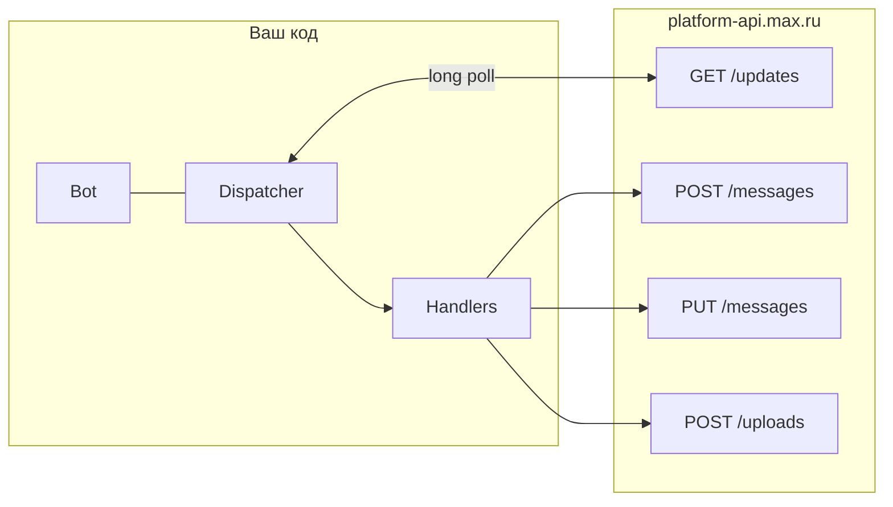

# Архитектура бота на MAX (messenger) и карта API

Документ описывает, как устроен бот на платформе **MAX** и какие **HTTP-эндпоинты** задействованы при использовании библиотеки **`maxapi`**. Без логики Wildberries — только слой MAX, чтобы перенести паттерн в другой проект.

Официальная документация API: [dev.max.ru — Bot API](https://dev.max.ru/docs-api).

---

## 1. Базовые параметры клиента

| Параметр | Значение |
|----------|----------|
| **Base URL** | `https://platform-api.max.ru` (константа `BaseConnection.API_URL` в `maxapi`) |
| **Авторизация** | HTTP-заголовок `Authorization: <токен_бота>` (сырой токен, как выдал кабинет MAX) |
| **Токен в окружении** | `MAX_BOT_TOKEN` (если не передать `Bot(token=...)`) |

Проверка токена и профиля бота: **`GET /me`** ([документация](https://dev.max.ru/docs-api/methods/GET/me)).

---

## 2. Архитектура приложения (как в этом репозитории)

Паттерн: **long polling** + **асинхронный диспетчер** событий.



1. **`Bot`** — HTTP-клиент ко всем методам API (хранит сессию `aiohttp`, заголовки, маркер обновлений).
2. **`Dispatcher`** — регистрирует обработчики и крутит **`start_polling(bot)`**: цикл **`GET /updates`** с `marker`, `limit`, `timeout`.
3. **Обработчики** — async-функции на типы апдейтов:
   - пользователь нажал «Старт» в интерфейсе бота → **`BotStarted`**;
   - новое сообщение в чат → **`MessageCreated`** (в т.ч. команды вроде `/start`);
   - нажатие inline-кнопки → **`MessageCallback`** (в payload приходит строка, которую вы сами зашили в кнопку).

Точка входа в проекте: `max_bot.py` — создание `Bot`/`Dispatcher`, регистрация хендлеров, `await dp.start_polling(bot)`.

Бизнес-логика (БД, внешние API) живёт в отдельном классе-хендлере; в MAX-слое остаются только маршрутизация по `callback.payload` и вызовы `bot.send_message` / `edit_message` / `message.answer`.

---

## 3. Эндпоинты MAX API, используемые типичным ботом

В `maxapi` пути собраны в `ApiPath`. Ниже — те, что реально нужны для клона «чат-бот с кнопками и картинками».

| HTTP | Путь | Назначение | Обычный вызов в `maxapi` |
|------|------|------------|---------------------------|
| **GET** | `/updates` | Long polling: новые события | `Dispatcher.start_polling` → внутри `GetUpdates` ([док](https://dev.max.ru/docs-api/methods/GET/updates)) |
| **POST** | `/messages` | Отправить сообщение (текст, вложения) | `bot.send_message(...)`, `message.answer(...)` ([док](https://dev.max.ru/docs-api/methods/POST/messages)) |
| **PUT** | `/messages` | Редактировать сообщение | `bot.edit_message(message_id=..., ...)` ([док](https://dev.max.ru/docs-api/methods/PUT/messages)) |
| **POST** | `/uploads` | Получить URL для загрузки файла (image/video/…) | внутри `process_input_media` при `InputMedia` / `InputMediaBuffer` ([док](https://dev.max.ru/docs-api/methods/POST/uploads)) |

Загрузка медиа (упрощённо):

1. `POST /uploads?type=...` → ответ с URL загрузки (и иногда промежуточным `token`).
2. Клиент **заливает байты** на выданный upload-URL (не на `platform-api.max.ru`).
3. В теле **`POST /messages`** (или **`PUT /messages`**) в `attachments` передаётся уже **токен вложения** после загрузки.

Библиотека делает шаги 1–3, если вы передали `InputMedia(path="...")` или `InputMediaBuffer(bytes)`.

Дополнительные эндпоинты в `ApiPath` (для других сценариев): `/chats`, `/videos`, `/answers`, `/actions`, `/pin`, `/members`, `/admins`, `/subscriptions` — смотрите [полную документацию](https://dev.max.ru/docs-api).

---

## 4. Модель данных в запросах (важно для своего кода)

### 4.1. Отправка сообщения

- Query: как минимум **`chat_id`** или **`user_id`** (личный диалог).
- JSON: **`text`**, **`attachments`** (массив), опционально **`notify`**, **`format`**, **`link`**, **`disable_link_preview`**.

Ограничение в `maxapi`: длина **`text` &lt; 4000** символов (`SendMessage`).

### 4.2. Inline-кнопки (callback)

- Строятся через **`InlineKeyboardBuilder`** и кнопки типа **`CallbackButton(text=..., payload=...)`**.
- **`payload`** — произвольная строка (у вас это маршрут: префиксы вроде `city_`, `warehouse_`, …).
- Для кнопки-**ссылки** в MAX нужен отдельный тип кнопки с полем **`url`** (не путать с `payload`).

### 4.3. Картинки по URL из интернета

В **`maxapi`** класс **`InputMedia`** принимает только **`path`** к файлу на диске, а не URL.

Паттерн для удалённого URL:

1. Скачать изображение (например `requests`/`aiohttp` в `asyncio.to_thread`).
2. Передать **`InputMediaBuffer(buffer=bytes, filename="photo.jpg")`** в `send_message` / `edit_message`.

Иначе попытка «обмануть» несуществующим `InputMedia(url=...)` приведёт к `TypeError` и тихому провалу, если ошибка проглочена.

### 4.4. Callback-события: откуда брать `chat_id` и `message_id`

В **`MessageCallback`** не всегда удобно взять `chat_id` из одного места. Рабочая схема:

- **`chat_id`**: `event.message.recipient.chat_id`, иначе fallback на **`event.callback.user.user_id`** (личка).
- **`message_id`** (для редактирования сообщения с кнопками): `event.message.body.mid`.

Ответ на нажатие кнопки часто делают так: **`PUT /messages`** с `message_id` (редактировать то же сообщение) или **`POST /messages`** (новое сообщение), а не «answer» с несуществующими для API полями — в этом проекте вынесено в хелпер **`_edit_or_send`**.

### 4.5. Команды бота

`bot.set_my_commands(...)` в `maxapi` уходит в **`PATCH /me`** (`ChangeInfo`). В актуальной спецификации метод может считаться устаревшим — на проде оборачивают в `try/except` и не падают, если вызов недоступен.

---

## 5. Особенность библиотеки `maxapi` (workaround)

При разборе ответов API с inline-клавиатурой у **`ChatButton`** поле **`chat_title`** в модели было обязательным, из-за чего **Pydantic v2** ломал десериализацию. В `max_bot.py` делается **monkey-patch**: `chat_title` по умолчанию `None` + `model_rebuild` для связанных моделей. Если в новой версии `maxapi` это исправят, патч можно убрать.

---

## 6. Минимальный скелет для другого проекта

Зависимость: `maxapi` (и транзитивно `aiohttp`). Установка: `pip install maxapi`.

```python
import asyncio
import logging
from maxapi import Bot, Dispatcher
from maxapi.types import BotStarted, MessageCreated, MessageCallback, Command, BotCommand
from maxapi.utils.inline_keyboard import InlineKeyboardBuilder
from maxapi.types import CallbackButton

logging.basicConfig(level=logging.INFO)

bot = Bot(token="YOUR_MAX_BOT_TOKEN")  # или MAX_BOT_TOKEN в env
dp = Dispatcher()


@dp.bot_started()
async def on_start(event: BotStarted):
    chat_id = event.chat_id
    await bot.send_message(chat_id=chat_id, text="Бот запущен. Напишите /start")


@dp.message_created(Command("start"))
async def on_cmd(event: MessageCreated):
    kb = InlineKeyboardBuilder()
    kb.row(CallbackButton(text="Тест", payload="ping"))
    await event.message.answer(text="Нажми кнопку", attachments=[kb.as_markup()])


@dp.message_callback()
async def on_cb(event: MessageCallback):
    if event.callback.payload == "ping":
        await bot.send_message(chat_id=event.message.recipient.chat_id, text="pong")


async def main():
    await dp.start_polling(bot)


if __name__ == "__main__":
    asyncio.run(main())
```

Дальше вы подключаете свои сервисы (БД, REST и т.д.) **за пределами** вызовов `send_message` / `edit_message`.

---

## 7. Полезные ссылки

- [MAX Bot API — обзор методов](https://dev.max.ru/docs-api)
- [maxapi на PyPI](https://pypi.org/project/maxapi/)
