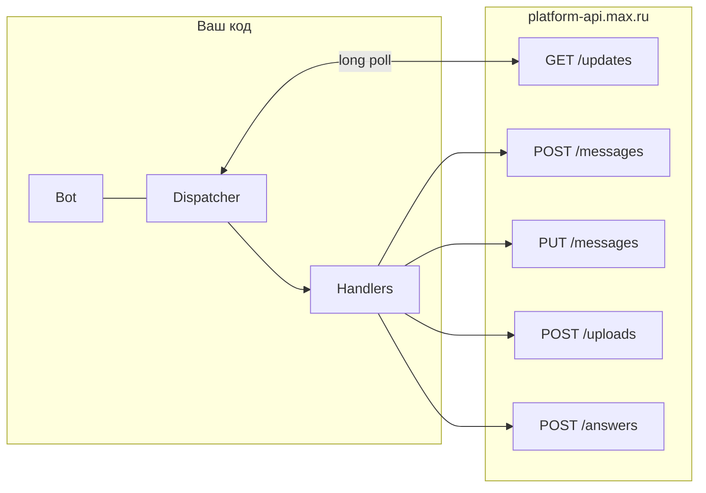

# Архитектура бота на MAX (messenger) и карта API

Документ описывает, как устроен бот на платформе **MAX** и какие **HTTP-эндпоинты** задействованы при использовании библиотеки **`maxapi`**. Без доменной логики WB — слой MAX и практические паттерны из этого репозитория.

Официальная документация API: [dev.max.ru — Bot API](https://dev.max.ru/docs-api).

---

## 1. Базовые параметры клиента

| Параметр | Значение |
|----------|----------|
| **Base URL** | `https://platform-api.max.ru` (константа `BaseConnection.API_URL` в `maxapi`) |
| **Авторизация** | HTTP-заголовок `Authorization: <токен_бота>` (сырой токен из кабинета MAX) |
| **Токен в окружении** | `MAX_BOT_TOKEN` (если не передать `Bot(token=...)`) |

Проверка токена и профиля бота: **`GET /me`** ([документация](https://dev.max.ru/docs-api/methods/GET/me)).

В проекте `config.py` подгружает **`.env` из каталога проекта** (`BASE_DIR / ".env"`), чтобы токен находился при любом `cwd` (systemd, `nohup`).

---

## 2. Архитектура приложения

Паттерн: **long polling** + **асинхронный диспетчер** событий.



1. **`Bot`** — HTTP-клиент (сессия `aiohttp`, заголовки, маркер обновлений, опционально **`after_input_media_delay`** — пауза после загрузки медиа по умолчанию ~2 с).
2. **`Dispatcher`** — регистрирует обработчики и **`start_polling(bot)`**: цикл **`GET /updates`** (`marker`, `limit`, `timeout`).
3. **Обработчики** (`max_bot.py` → `MaxHandler`):
   - **`BotStarted`** — пользователь открыл бота через «Старт» в клиенте;
   - **`MessageCreated` + `Command('start')`** — текстовая команда `/start`;
   - **`MessageCreated` без фильтра** — любой другой текст (подсказка «используйте кнопки»), чтобы бот не казался «молчащим»;
   - **`MessageCallback`** — нажатие inline-кнопки (`payload` — ваша маршрутизация).

Точка входа: **`max_bot.py`**. Бизнес-логика — в **`max_handler.py`** (роутинг по `callback.payload`, Google Sheets, внешние API — за пределами этого документа).

---

## 3. Эндпоинты MAX API (типичный бот с кнопками и картинками)

| HTTP | Путь | Назначение | Вызов в `maxapi` |
|------|------|------------|------------------|
| **GET** | `/updates` | Long polling | `Dispatcher.start_polling` → `GetUpdates` ([док](https://dev.max.ru/docs-api/methods/GET/updates)) |
| **POST** | `/messages` | Отправка сообщения | `bot.send_message`, `message.answer` ([док](https://dev.max.ru/docs-api/methods/POST/messages)) |
| **PUT** | `/messages` | Редактирование | `bot.edit_message` ([док](https://dev.max.ru/docs-api/methods/PUT/messages)) |
| **POST** | `/uploads` | URL для загрузки файла | внутри `process_input_media` для `InputMedia` / `InputMediaBuffer` ([док](https://dev.max.ru/docs-api/methods/POST/uploads)) |
| **POST** | `/answers` | Ответ на callback (кнопка) | `bot.send_callback(callback_id=...)` ([док](https://dev.max.ru/docs-api/methods/POST/answers)) |

Остальные пути в `ApiPath`: `/chats`, `/videos`, `/actions`, `/pin`, `/members`, `/admins`, `/subscriptions` — см. [документацию](https://dev.max.ru/docs-api).

### Загрузка медиа

1. `POST /uploads?type=...` → URL загрузки (+ иногда промежуточный token).
2. Заливка байтов на выданный **upload-URL** (не на `platform-api.max.ru`).
3. В **`POST /messages`** в `attachments` передаётся токен вложения после загрузки.

`maxapi` делает это при передаче **`InputMedia(path=...)`** или **`InputMediaBuffer(bytes)`**.

### Скорость серии сообщений с картинками

В **`SendMessage`** после медиа по умолчанию вызывается **`asyncio.sleep(bot.after_input_media_delay)`** (часто **2 с** на **каждое** сообщение с картинкой), плюс при ошибке **`attachment.not.ready`** есть повторы.

Чтобы ускорить массовую рассылку (список заказов):

- вызывать **`bot.send_message(..., sleep_after_input_media=False)`** — паузу отключаете, ретраи по `attachment.not.ready` остаются;
- **параллельно** скачивать уникальные URL картинок (**`asyncio.gather` + `Semaphore`**), затем слать по одному сообщению на заказ (в этом репозитории: **`_prefetch_image_bytes`** + цикл отправки).

---

## 4. Модель данных и идентификаторы

### 4.1. Отправка сообщения

Query: **`chat_id`** или **`user_id`** (личка). В MAX **`chat_id` и `user_id` пользователя могут различаться** — если отправка по `chat_id` не срабатывает, имеет смысл повторить с **`user_id`** из `callback.user` или `recipient`.

JSON: **`text`**, **`attachments`**, опционально **`notify`**, **`format`**, **`link`**, **`disable_link_preview`**.

Ограничение `maxapi`: **`text` &lt; 4000** символов.

### 4.2. Inline-кнопки

- **`InlineKeyboardBuilder`** + **`CallbackButton(text=..., payload=...)`**.
- Кнопка-**ссылка** — отдельный тип с полем **`url`** (не `payload` со ссылкой).

### 4.3. Картинки по URL

**`InputMedia`** принимает только **`path`** к локальному файлу, не URL.

Паттерн: скачать байты → **`InputMediaBuffer(buffer=..., filename="photo.jpg")`**. Вызов **`InputMedia(url=...)`** в `maxapi` невалиден.

### 4.4. Callback: `chat_id`, `user_id`, `message_id`

- Идентификаторы для матчинга с вашей БД/таблицами: перебирать **`recipient.chat_id`**, **`recipient.user_id`**, **`callback.user.user_id`** — в Access/ролях часто записан один из них.
- Редактирование сообщения с кнопками: **`event.message.body.mid`** → **`PUT /messages`**.
- В проекте: **`_edit_or_send`** — сначала **`edit_message`**, при ошибке **`send_message`** (с приоритетом **`user_id`** для лички).

### 4.5. Подтверждение нажатия кнопки

После обработки логики (в т.ч. в **`finally`**) вызывается **`bot.send_callback(callback_id=...)`** → **`POST /answers`**, иначе клиент MAX может долго «крутить» нажатие.

### 4.6. Команды бота

`bot.set_my_commands(...)` в `maxapi` идёт в **`PATCH /me`** и может быть помечен как устаревший — оборачивают в **`try/except`**.

---

## 5. Workaround `maxapi` (Pydantic)

У **`ChatButton`** поле **`chat_title`** было обязательным → падала десериализация ответов с клавиатурой. В **`max_bot.py`**: **`chat_title` по умолчанию `None`** + **`model_rebuild`** для связанных моделей.

---

## 6. Минимальный скелет (другой проект)

```python
import asyncio
import logging
from maxapi import Bot, Dispatcher
from maxapi.types import BotStarted, MessageCreated, MessageCallback, Command, BotCommand
from maxapi.utils.inline_keyboard import InlineKeyboardBuilder
from maxapi.types import CallbackButton

logging.basicConfig(level=logging.INFO)

bot = Bot(token="YOUR_MAX_BOT_TOKEN")
dp = Dispatcher()


@dp.bot_started()
async def on_start(event: BotStarted):
    await bot.send_message(chat_id=event.chat_id, text="Напишите /start")


@dp.message_created(Command("start"))
async def on_cmd(event: MessageCreated):
    kb = InlineKeyboardBuilder()
    kb.row(CallbackButton(text="Тест", payload="ping"))
    await event.message.answer(text="Нажми кнопку", attachments=[kb.as_markup()])


@dp.message_callback()
async def on_cb(event: MessageCallback):
    try:
        if (event.callback.payload or "").strip() == "ping":
            await bot.send_message(
                user_id=event.callback.user.user_id,
                text="pong",
            )
    finally:
        try:
            await bot.send_callback(callback_id=event.callback.callback_id)
        except Exception:
            pass


async def main():
    await dp.start_polling(bot)


if __name__ == "__main__":
    asyncio.run(main())
```

---

## 7. Полезные ссылки

- [MAX Bot API](https://dev.max.ru/docs-api)
- [maxapi на PyPI](https://pypi.org/project/maxapi/)
